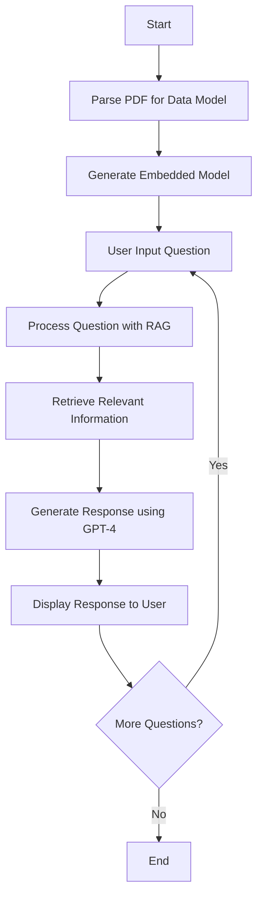

# llamaindex-projects
My playground for LlamaIndex experiments

# ChatWithAmarpreet

## Project Description

ChatWithAmarpreet is a basic implementation of a Retrieval-Augmented Generation (RAG) model using the LlamaIndex framework and OpenAI's GPT-4 model. This project demonstrates how to parse PDF data, generate embedded models, and use them to get responses in a chat-like interface.

While similar functionality can be achieved using ChatGPT directly, this project serves as an educational tool for understanding the RAG model and its implementation. It provides hands-on experience with:

- PDF data model parsing
- Embedding generation
- LlamaIndex framework usage
- Integration with OpenAI's GPT-4 model
- Deployment on Vercel

## Features

- PDF data parsing
- Embedded model generation
- RAG-based question answering
- Integration with OpenAI's GPT-4 model
- Vercel deployment

## Technology Stack

- LlamaIndex framework
- OpenAI GPT-4 model
- Typescript
- Vercel (for hosting)

## Project Flow

## [Youtube Demo on chat-with-Amarpreet app](https://www.youtube.com/watch?v=KxY5PQNwk5M)

## Steps to Build yours
1. `npx create-llama@latest`
2. Follow the steps (provide API key in terminal, recommended acc to LlamaIndex)
3. Get the openai api key from this [link](https://platform.openai.com/api-keys)
4. Upload files inside data folder (bydefault there is one pdf)
5. Cd to app, run `npm run dev`

## Learning
[Short Course to learn about more](https://www.deeplearning.ai/short-courses/javascript-rag-web-apps-with-llamaindex/)

