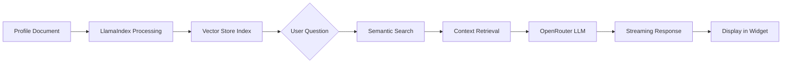

# Chat with Amarpreet - Professional AI Portfolio 🚀

A modern, AI-powered professional portfolio website featuring an intelligent chatbot trained on enterprise experience and expertise. Built with **Next.js 14**, **LlamaIndex**, and **OpenRouter AI** — deployed on Vercel.

## 🎯 Project Overview

This project showcases **Amarpreet Bhatia's** professional background as an **Enterprise AI Enablement Architect** with 20+ years of experience in cloud-native transformation, platform engineering, and AI-first solutions.

### What Makes This Special

✨ **Professional Portfolio Website**
- Modern, responsive design (mobile to desktop)
- Hero section with key achievements and metrics
- Detailed experience timeline and career progression
- Comprehensive skills and certifications showcase
- Sticky navigation with smooth scrolling
- Professional footer with social links

🤖 **Intelligent AI Chatbot**
- Trained on professional profile using RAG (Retrieval-Augmented Generation)
- Powered by **OpenRouter API** (supports multiple LLMs)
- Uses **LlamaIndex** for semantic search and context retrieval
- Floating widget for continuous accessibility
- Real-time streaming responses
- Smart system prompt for professional interactions

🚀 **Production-Ready Implementation**
- Built with **Next.js 14** and **TypeScript**
- **Tailwind CSS** for modern, responsive styling
- Optimized for **Vercel** deployment
- Environment-based configuration
- Fast refresh during development

## 📊 Project Flow


```mermaid
graph LR
    A[Profile Document] --> B[LlamaIndex Processing]
    B --> C[Vector Store Index]
    C --> D{User Question}
    D --> E[Semantic Search]
    E --> F[Context Retrieval]
    F --> G[OpenRouter LLM]
    G --> H[Streaming Response]
    H --> I[Display in Widget]
```

## 🚀 Quick Start

### 1. Install & Setup (2 minutes)
```bash
cd chatwithamarpreet
npm install
```

### 2. Generate AI Knowledge Base (1 minute)
```bash
npm run generate
```
This creates embeddings and indexes from the professional profile.

### 3. Start Development Server (instant)
```bash
npm run dev
```

### 4. View & Test
- Portfolio: http://localhost:3000
- Click the chat widget to ask questions
- Example: "Tell me about Amarpreet's AI expertise"

## 📁 Project Structure

```
chatwithamarpreet/
├── app/
│   ├── api/chat/
│   │   ├── engine/
│   │   │   ├── openrouter.ts      ⭐ OpenRouter integration
│   │   │   ├── settings.ts        ⭐ LLM configuration
│   │   │   ├── chat.ts           # Chat engine
│   │   │   ├── loader.ts         # Document loading
│   │   │   └── generate.ts       # Index generation
│   │   └── route.ts              # Chat API endpoint
│   ├── components/
│   │   ├── professional-header.tsx   ⭐ Navigation
│   │   ├── floating-chat-widget.tsx  ⭐ Chat widget
│   │   ├── profile/
│   │   │   ├── profile-hero.tsx     ⭐ Hero section
│   │   │   ├── portfolio-content.tsx ⭐ Main profile
│   │   │   └── profile-components.tsx
│   │   ├── footer.tsx               ⭐ Footer
│   │   └── ui/chat/                 # Chat UI
│   ├── page.tsx                  ⭐ Main page
│   └── layout.tsx
├── data/
│   └── amarpreet_profile.md      # AI knowledge base
├── cache/                        # Vector store cache
├── .env.local                    # Configuration
├── SETUP_GUIDE.md               # Setup & deployment
└── README_PORTFOLIO.md          # Feature documentation
```

⭐ = New/redesigned files

## 🛠️ Technology Stack

| Layer | Technology | Why |
|-------|-----------|-----|
| **Frontend** | Next.js 14, React 18 | Fast, modern, Vercel-optimized |
| **Styling** | Tailwind CSS | Rapid, responsive design |
| **AI/ML** | LlamaIndex | Powerful RAG implementation |
| **LLM** | OpenRouter API | Multiple model support, cost-effective |
| **Backend** | Node.js API Routes | Serverless, scalable |
| **Deployment** | Vercel | Seamless Next.js hosting |
| **Types** | TypeScript | Type-safe development |
| **Icons** | Lucide React | Beautiful SVG icons |
| **UI** | Radix UI | Accessible components |

## 🤖 How the AI Works

### RAG (Retrieval-Augmented Generation) Flow

1. **Indexing** (npm run generate)
   - Profile markdown is processed by LlamaIndex
   - Text is split into semantic chunks
   - Embeddings are generated for each chunk
   - Index is stored in `./cache` for fast retrieval

2. **Question Processing** (User asks a question)
   - Question is converted to embedding
   - Semantic search finds relevant profile sections (TOP_K=3)
   - Retrieved context is formatted

3. **Response Generation** (LLM processes context + question)
   - OpenRouter LLM receives:
     - System prompt (professional instructions)
     - Retrieved profile context
     - User question
   - Generates intelligent, contextual response
   - Streams response in real-time

### Key Configuration
```env
MODEL_PROVIDER=openrouter           # Use OpenRouter
OPENROUTER_API_KEY=sk-or-v1-...    # API key
MODEL=openai/gpt-3.5-turbo        # LLM model
EMBEDDING_MODEL=...                # Embedding model
TOP_K=3                            # Context documents
SYSTEM_PROMPT=...                  # AI behavior
```

## ⚙️ Configuration & Customization

### Environment Variables
Create `.env.local` in `chatwithamarpreet/` directory:

```env
# OpenRouter API
MODEL_PROVIDER=openrouter
OPENROUTER_API_KEY=your_key_here
MODEL=openai/gpt-3.5-turbo

# LLM Settings
EMBEDDING_MODEL=sentence-transformers/all-MiniLM-L6-v2
LLM_MAX_TOKENS=4096

# RAG Configuration
TOP_K=3
SYSTEM_PROMPT=You are an expert AI assistant...
```

See `.env.example` for complete reference.

### Customize Profile Content
Edit `app/components/profile/portfolio-content.tsx`:
- Update experience entries
- Modify skills list
- Change certifications
- Update call-to-action

### Customize Chat Behavior
Edit `.env.local` `SYSTEM_PROMPT` to change:
- Tone and personality
- Response style
- Focus areas

### Add More Documents
1. Place `.md`, `.txt`, or `.pdf` files in `./data/`
2. Run `npm run generate`
3. Chatbot automatically learns from new documents

## 🚢 Deployment to Vercel

### Prerequisites
- GitHub repository
- Vercel account
- Environment variables ready

### Deployment Steps

1. **Prepare Code**
```bash
git add .
git commit -m "Professional portfolio redesign"
git push origin main
```

2. **Connect with Vercel**
   - Go to [vercel.com](https://vercel.com)
   - Import your GitHub repository
   - Add environment variables in Settings
   - Deploy

3. **Configure Build Command**

Add to `vercel.json` or in Vercel project settings:
```json
{
  "buildCommand": "npm run generate && npm run build"
}
```

4. **Go Live!**
   - Your portfolio is now at `https://your-domain.vercel.app`
   - Share with recruiters and hiring managers

**Full deployment guide**: See [SETUP_GUIDE.md](./chatwithamarpreet/SETUP_GUIDE.md#-deployment-to-vercel)

## 📚 Documentation

| Document | Content |
|----------|----------|
| [README_PORTFOLIO.md](./chatwithamarpreet/README_PORTFOLIO.md) | Feature overview, quick start, tech stack |
| [SETUP_GUIDE.md](./chatwithamarpreet/SETUP_GUIDE.md) | Complete setup, deployment, troubleshooting |
| [.env.example](./chatwithamarpreet/.env.example) | Environment variable reference |
| [profile.md](./profile.md) | Source professional profile |

## 🎓 What You'll Learn

This project demonstrates:
- ✅ **RAG Systems**: Building AI with external knowledge
- ✅ **LlamaIndex**: Indexing, embedding, retrieval
- ✅ **Next.js**: Modern React framework
- ✅ **API Integration**: OpenRouter LLM API
- ✅ **Responsive Design**: Mobile-first Tailwind CSS
- ✅ **TypeScript**: Type-safe development
- ✅ **Vercel Deployment**: Production hosting

## 🔐 Security

- ✅ API keys in environment variables (never committed)
- ✅ `.env.local` in `.gitignore`
- ✅ HTTPS enforced on Vercel
- ✅ Rate limiting recommended for production

## 📊 Performance Metrics

- ⚡ First load: < 2 seconds (Vercel CDN)
- 🤖 LLM response: 1-3 seconds (streaming)
- 🔍 Search retrieval: < 500ms
- 📱 Mobile score: 90+ (Lighthouse)

## 🆘 Troubleshooting

**Vector store not found?**
```bash
npm run generate
```

**Chat not working?**
- Check API key in `.env.local`
- Verify `MODEL_PROVIDER=openrouter`
- Check browser console for errors

**Build fails on Vercel?**
- Ensure `npm run generate` runs before build
- Check Vercel build logs

**More help?** → See [SETUP_GUIDE.md troubleshooting](./chatwithamarpreet/SETUP_GUIDE.md#-troubleshooting)

## 🚀 Next Steps

1. ✅ **Review** the portfolio at http://localhost:3000
2. ✅ **Test** the AI chatbot with sample questions
3. ✅ **Customize** profile content and styling
4. ✅ **Deploy** to Vercel
5. ✅ **Share** with recruiters and connections!

## 📚 Resources

- [LlamaIndex Docs](https://docs.llamaindex.ai/) - RAG & AI
- [OpenRouter Docs](https://openrouter.ai/docs) - LLM Models
- [Next.js Docs](https://nextjs.org/docs) - Framework
- [Tailwind CSS](https://tailwindcss.com) - Styling
- [Vercel Docs](https://vercel.com/docs) - Deployment

## 🎯 Use Cases

Perfect for:
- 🎓 Professional portfolio presentation
- 💼 Job searching and recruitment
- 🚀 Showcasing AI/ML expertise
- 🌟 Building thought leadership
- 💡 Demonstrating AI integration skills
- 🤝 Making hiring conversations easier

## 📄 License & Attribution

This project is based on Amarpreet Bhatia's professional experience and expertise.

---

### Built with ❤️ using:
- **Next.js 14** – React Framework
- **LlamaIndex** – AI Indexing & RAG
- **OpenRouter** – LLM API Access
- **Tailwind CSS** – Modern Styling
- **Vercel** – Deployment Platform
- **TypeScript** – Type Safety

**Ready to make a professional impression? Let's launch! 🚀**

For detailed setup, see [SETUP_GUIDE.md](./chatwithamarpreet/SETUP_GUIDE.md)

## Steps to Build yours
1. `npx create-llama@latest`
2. Follow the steps (provide API key in terminal, recommended acc to LlamaIndex)
3. Get the openai api key from this [link](https://platform.openai.com/api-keys)
4. Upload files inside data folder (bydefault there is one pdf)
5. Cd to app, run `npm run dev`

## Learning
[Short Course to learn about more](https://www.deeplearning.ai/short-courses/javascript-rag-web-apps-with-llamaindex/)

